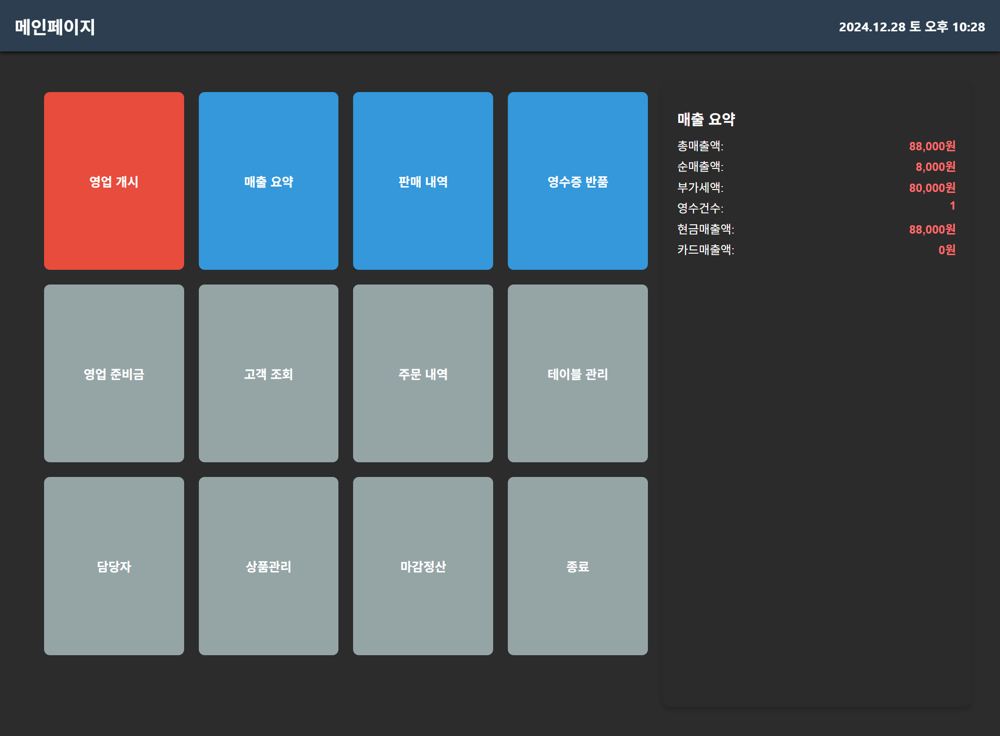
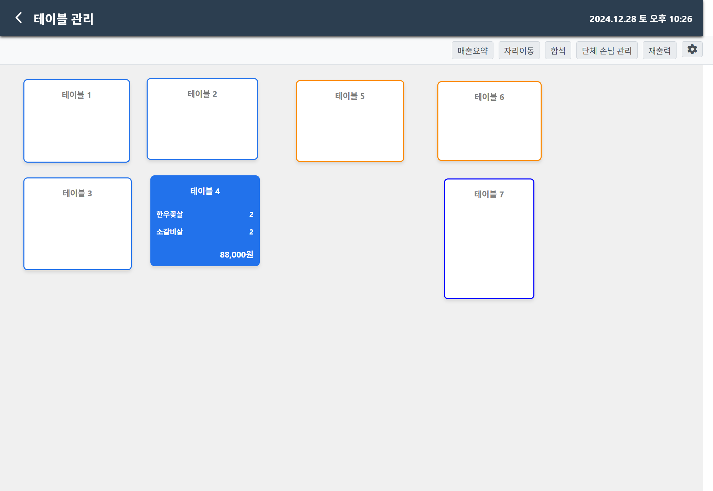
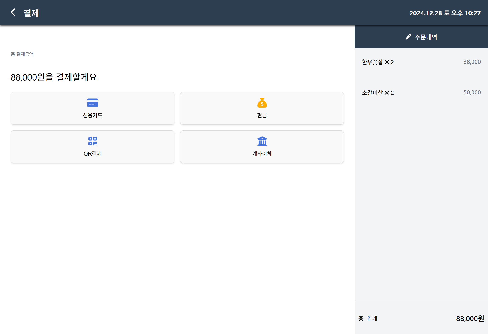
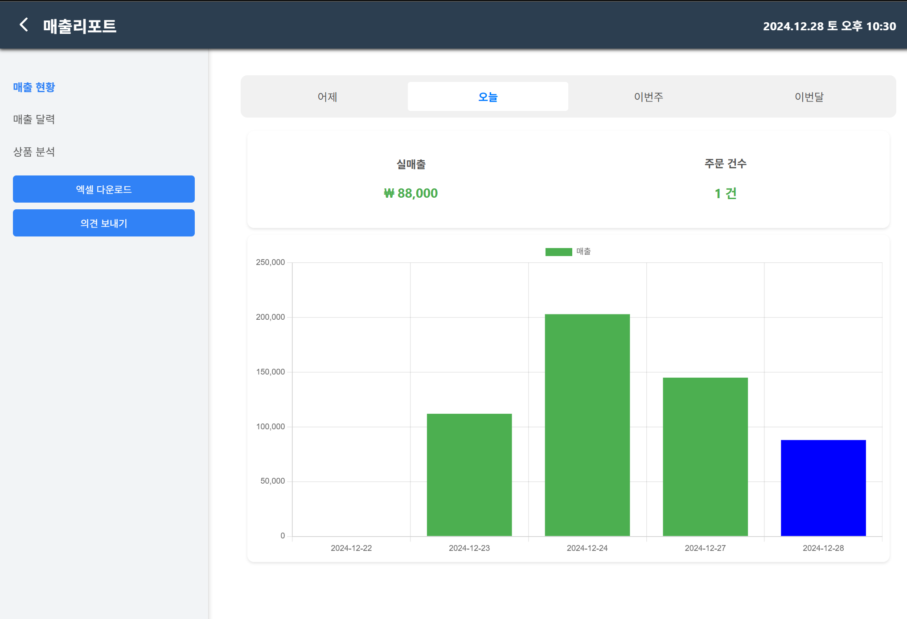

   
  

   
  <h1>EZ - POS</h1>
  
   

## 목차

1. **웹 서비스 소개**
2. **기술 스택**
3. **주요 기능**
4. **주요 페이지**
5. **개발 일정**
6. **팀원**

 

## 💁🏻‍♂ 웹 서비스 소개

&nbsp;&nbsp;판매정보관리 시스템으로 오프라인상점에서 주문, 결제, 이전의 정산 금액을 확인하고 싶을때 모니터를 보며 조작하는 프로그램입니다.

 

[**🔗 배포된 웹 서비스로 바로가기 Click !**](#) 👈

> 새 창 열기 방법 : CTRL+click (on Windows and Linux) | CMD+click (on MacOS)

 

## 🛠 기술 스택

**Front-end**

-   
- 
- 

**Back-end**

- 
- 
- 
- 
- 
- 
- 
- 
- 

**ETC**
- 
- 
-  
- 
- 

## 💡 주요 기능

- 가게 OPEN 및 CLOSE 후 데이터 마감정산
- 카테고리 & 메뉴 SelfJoin이용
- 각 테이블에 들어간 주문 상황을 실시간으로 시각적으로 보여주는 기능
- 테이블의 이동, 테이블삭제, 합석 기능 구현
- 결제 프로세스와 당일 매출금액 및 차트 확인기능구현

 

## 📄 주요 페이지

|                               메인 페이지                               |                               Dining 페이지                               |
| :---------------------------------------------------------------------: | :---------------------------------------------------------------------: |
|  |  |
|                               주문 페이지                               |                               결제 페이지                               |
|  |  |
|                               매출 요약 페이지                               |          
|  |

 

## 📅 개발 일정
|                                                              |                               기간                               |
| :--------------------------------------------------: | :--------------------------------------------------------: |
| 1차개발  (DB설계)                                 |                      2024.10.26 - 2024.11.01               |
| 2차개발  (SpringBoot - Back 작성)     |                      2024.11.02 - 2024.11.15               |
| 3차개발  (React - Front 작성 )   |                      2024.11.16 - 2024.11.29               |
| 4차개발  (전체적인 HTML&CSS 수정)   |                      2024.11.30 - 2024.12.09               |
| 최종제출 & 발표   |                     2024.12.10              |

 

## 😳 팀원

- 김다니([/rlaeksl0124](https://github.com/rlaeksl0124)) 테이블관리, 주문, 주문상세, 영업개시&마감
- 안중섭([/n90425](https://github.com/n90425)) 상품관리, 결제, 결제내역
- 황정하([/ghkdwjdgk123](https://github.com/ghkdwjdgk123)) 매출요약
